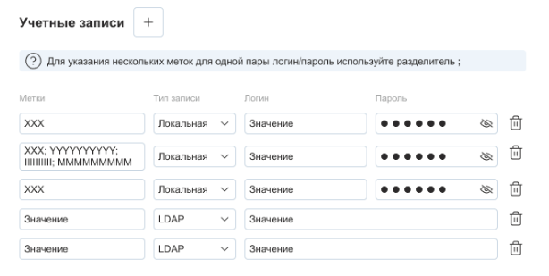

# Test task SaaSoft

<p align="center">
  
</p>

## Задание

Необходимо реализовать форму управления учетными записями.



## Стек технологий

- Vue.js 3 + Composition API (фреймворк)
- TypeScript (язык)
- Pinia (стейт менеджер)
- Любой UI фреймворк на выбор.

## Время на выполнения

2 дня

## Запуск приложения

Установка зависемостей

```bash
yarn install
```

Запуск

```bash
yarn run dev
```

Приложение запуститься на http://localhost:5173/
